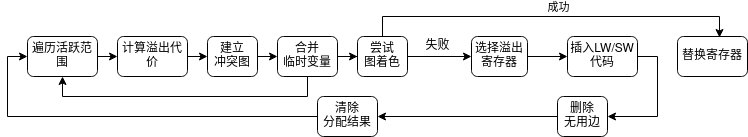

# 实验总结
## 实验进度
`目前实现了以下功能`
1. 定义变量 int array
2. 变量赋值 int array
3. 全局变量
4. 常量const
5. 循环语句while
6. 分支语句if
7. 函数定义
8. 函数调用
9. SysY系统库函数

目前通过了SysY2021的103个功能测试
## 项目结构
```
├── 3rdparty
│   ├── hash.hpp
│   ├── hash_fun.hpp
│   ├── hash_iterator.hpp
│   ├── hash_map.hpp
│   ├── hash_table.hpp
│   ├── list.hpp
│   ├── map.hpp
│   ├── set.hpp
│   ├── stack.hpp
│   └── vector.hpp
├── backend
│   └── asm
│       ├── arm_frame_manager.cpp
│       ├── arm_frame_manager.hpp
│       ├── arm_md.cpp
│       ├── arm_md.hpp
│       ├── mach_desc.hpp
│       ├── offset_counter.cpp
│       └── offset_counter.hpp
├── frontend
│   ├── parser
│   │   ├── SysY.g4
│   │   ├── SysY.interp
│   │   ├── SysY.tokens
│   │   ├── SysYBaseVisitor.cpp
│   │   ├── SysYBaseVisitor.h
│   │   ├── SysYLexer.cpp
│   │   ├── SysYLexer.h
│   │   ├── SysYLexer.interp
│   │   ├── SysYLexer.tokens
│   │   ├── SysYParser.cpp
│   │   ├── SysYParser.h
│   │   ├── SysYVisitor.cpp
│   │   └── SysYVisitor.h
│   ├── scope
│   │   ├── func_scope.cpp
│   │   ├── global_scope.cpp
│   │   ├── local_scope.cpp
│   │   ├── scope.cpp
│   │   ├── scope.hpp
│   │   ├── scope_stack.cpp
│   │   └── scope_stack.hpp
│   ├── symb
│   │   ├── function.cpp
│   │   ├── symbol.cpp
│   │   ├── symbol.hpp
│   │   └── variable.cpp
│   ├── tac
│   │   ├── dataflow.cpp
│   │   ├── flow_graph.cpp
│   │   ├── flow_graph.hpp
│   │   ├── tac.cpp
│   │   ├── tac.hpp
│   │   ├── trans_helper.cpp
│   │   └── trans_helper.hpp
│   ├── translation
│   │   ├── generate_ir.cpp
│   │   └── generate_ir.hpp
│   └── type
│       ├── array_type.cpp
│       ├── base_type.cpp
│       ├── func_type.cpp
│       ├── type.cpp
│       └── type.hpp
├── main.cpp
├── optimizer
│   ├── pass.hpp
│   └── ssa.cpp
└── util
    ├── config.hpp
    ├── define.hpp
    ├── error.cpp
    ├── error.hpp
    ├── errorbuf.hpp
    ├── location.hpp
    ├── misc.cpp
    ├── options.cpp
    └── options.hpp
```
## 前端
前端的语法分析和词法分析使用Antlr工具完成，通过Antlr生成语法分析树通过遍历语法分析树生成中间IR（四元式）
在前端分为：
1. parser：实现词法和语法分析规则xxx.g4，由Antlr生成相应代码
2. scope：作用域，分为函数作用域，全局作用域，局部作用域以及堆栈作用域共同继承自scope类
```cpp
class Scope {
  protected:
    // the underlying map
    std::unordered_map<std::string, symb::Symbol *> _syms;

  public:
    // kind of the scopes
    typedef enum { GLOBAL, FUNCTION, LOCAL } kind_t;

    // the iterator type
    typedef ScopeIterator iterator;
    // Gets the scope kind
    virtual kind_t getKind(void) = 0;
    // Tests whether it is a global scope
    virtual bool isGlobalScope(void);
    // Tests whether it is a function scope
    virtual bool isFuncScope(void);
    // Looks up a name in this scope
    virtual symb::Symbol *lookup(std::string);
    // Declares a symbol in this scope
    virtual void declare(symb::Symbol *);
    // Cancels an already-declared symbol in this scope
    virtual void cancel(symb::Symbol *);
    // Gets the begin iterator
    virtual iterator begin(void);
    // Gets the beyond-last iterator
    virtual iterator end(void);
    // Prints the content of this scope
    virtual void dump(std::ostream &) = 0;

    virtual ~Scope() {}
};
```
3. symb：符号表，包括变量和函数。共同继承自Symbol
```cpp
    class Symbol {
  protected:
    // name of this symbol
    std::string name;
    // type of this symbol
    type::Type *type;
    // the scope where this symbol is defined
    scope::Scope *defined_in;
    // the order of this symbol
    int order;

  public:
    // auxiliary mark
    int mark;
    // offset of this symbol
    int offset;
    // Gets the name of this symbol
    virtual std::string getName(void);
    // Gets the type of this symbol
    virtual type::Type *getType(void);
    // Gets the order
    virtual int getOrder(void);
    // Sets the order
    virtual void setOrder(int order);
    // Tests whether it is a Variable
    virtual bool isVariable(void);
    // Tests whether it is a Function
    virtual bool isFunction(void);
    // Gets the scope where this symbol was declared
    virtual scope::Scope *getScope(void);
    // Sets the scope of this symbol
    virtual void setScope(scope::Scope *);
    // Prints this symbol
    virtual void dump(std::ostream &) = 0;

    virtual ~Symbol() {}
};
```
4. tac：中间IR，在这部分，我们使用四元式，这部分包括四元式的数据结构的定义，CFG的实现以及代码的活跃性分析。
```cpp
typedef struct TempVariable
    {
        int id;               // 临时变量的编号
        int size;             // 所占字节数
        bool is_offset_fixed; // 临时变量是否被分配空间
        int offset;           // FP寄存器的偏移量
        int ctval;            // 编译时刻的静态值
        bool isConst;         // 是否常量
        int reg;
    } * Temp;

    typedef struct LabelObject
    {
        int id;               // Label的编号
        std::string str_form; // Label的string形式
        bool target;          // 是否是目标Label
        Tac *where;           // The TAC which marks this Label (for dataflow analysis)
    } * Label;
    
    typedef struct FunctyObject
    {
        Label entry;        // 函数的入口Label
        Tac *code;          // 函数所对应的TAC
    } * Functy;

    typedef struct GlobalObject
    {
        std::string name;   //全局变量名
        int value;          //全局变量值
        int size;           //所占大小
        bool isConst;       //是否常量
    } * GlobalVar;

    typedef struct GlobalArray
    {
        std::string name;   //全局变量名
        util::Vector<int> values;//全局变量值
        int size;           //所占大小
        bool isConst;       //是否常量
    } * GlobalArr;
```
5. translation：这部分实现IR的翻译，继承自SysYBaseVisitor通过遍历语法分析树生成IR
6. type：定义基本数据类型
```cpp
class Type {
  public:
    // Tests whether this type is BaseType
    virtual bool isBaseType(void);
    // Tests whether this type is ArrayType
    virtual bool isArrayType(void);
    // Tests whether this type is FuncType
    virtual bool isFuncType(void);
    // Get the size of this type
    virtual int getSize() { return 0; }
    // Tests whether this type is compatible with the given type
    // NOTE:
    //   if "a <- b" is legal, then type(b) is compatible with type(a)
    virtual bool compatible(Type *) = 0;
    // Tests whether this type is equal to the given type
    virtual bool equal(Type *) = 0;
    // Prints this type
    virtual void dump(std::ostream &) = 0;

    virtual ~Type() {}
};

```
## 后端
1. 基于线性扫描的寄存器分配算法
2. 基于图着色的寄存器分配算法
### 结构


### 总体流程




### 计算溢出代价

已经明确强制分配为物理寄存器的代价应当为无穷, 如果是

其他情况下缨丹基于其使用的指令求和, 具体来说, 

近似的由下列方法计算(参考高级编译器设计与实现):

1\*sum(1<<(3\*depth(def))) + 2\*sum(1<<(3\*depth(def))


### 冲突图的创建

将控制流图的结果导入, 然后对活跃变量分析的结果(LiveIn, LiveUse, LiveOut)遍历, 两两变量为一边

但这种方法的精度其实不高, 如果能换成基于SSA的du链, 会有明显的性能提升


### 合并临时变量

搜索复制临时变量的指令, 并将复制指令得到的临时变量合并


### 图分配的两种算法(Welch-Powell和DSaut)

目前只使用了Welch-Powell算法, DSaut被选, 另外还在阅读Lawler的精确解算法论文

如果可以实现的话可能会考虑按照寄存器的数量不同使用不同的算法

另外, 在原始算法之上, 还加入了如果超过最大可分配数量就报错退出的特性


#### Welch-Powell算法

1.  按照每个图的度数进行从大到小排序
2.  取未分配的度数最大的节点
3.  用同一种颜色染色所有的不相邻且不冲突的节点直至其完全染色


#### DSatur算法

每次选择所有未分配点中邻居使用的不同颜色最多的一个进行着色,

如果没有就用度数最多的一个进行着色

用没被其邻居用过的最小色号染色, 直到其所有的节点都染色过


### 插入存数和取数的代码

遍历整个IR, 然后对其使用了选中的代价最小的溢出寄存器的指令:

如果是定义, 则在之后插入STORE

如果是使用, 则在之前插入LOAD

注意记得向栈帧管理器申请空间


### 删除无用边/更新

理论上完全重新建立新的冲突图当然可以, 但每次建立开销都是O(n<sup>2</sup>), 最好能剪枝

在插入存数和取数指令后, 取新的活跃变量分析结果, 更新邻接图和邻接表

能够删除的边必然是涉及溢出寄存器的, 但似乎不是所有的边都能删除,具体的标准我还没有很清楚

也许后续能找到相关的文献教材或者论文解释这个问题


## 后续工作

1. 完成合并和代码的补全工作

2. 将LiveRange改为DU链的(依赖SSA)

3. 尝试将引入其他图着色算法, 并开发合适的近似解着色算法

4. 尝试解决特殊类型的寄存器分配和定向分配问题


## 优化
1. 静态单赋值形式（SSA）
学习tarjan的支配树算法，将基本块转化成支配树，并插入$phi$函数
2. 常量折叠
针对常量、常量表达式直接用编译时计算出的值进行替换。
针对一些布尔表达式（如false&&x、true||y）直接替换。
